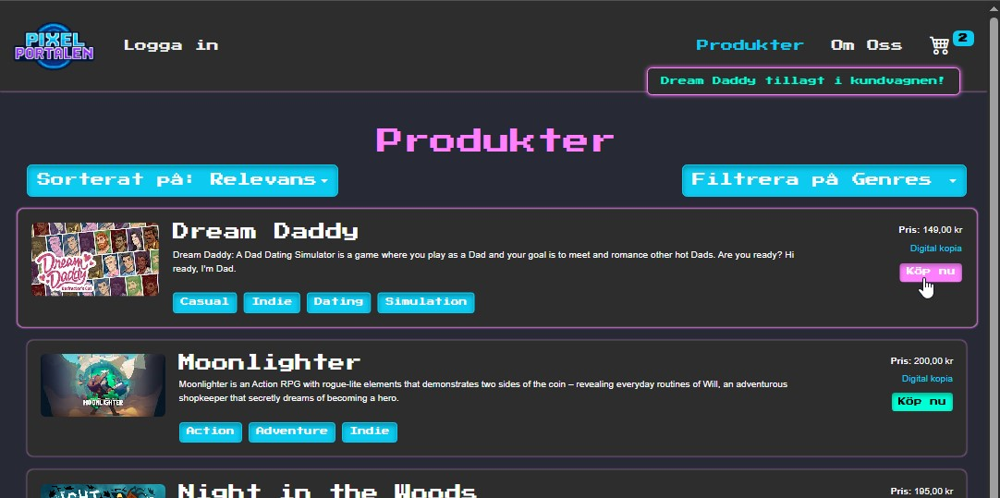
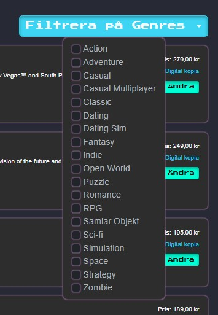
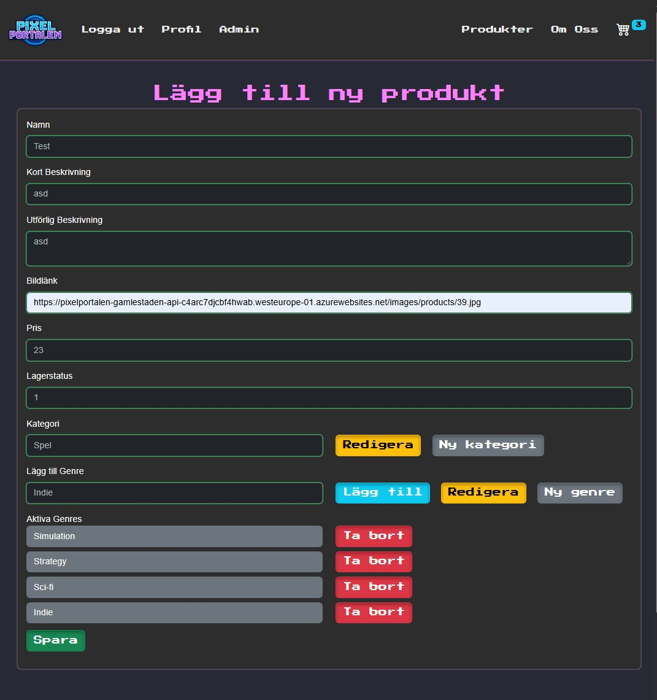
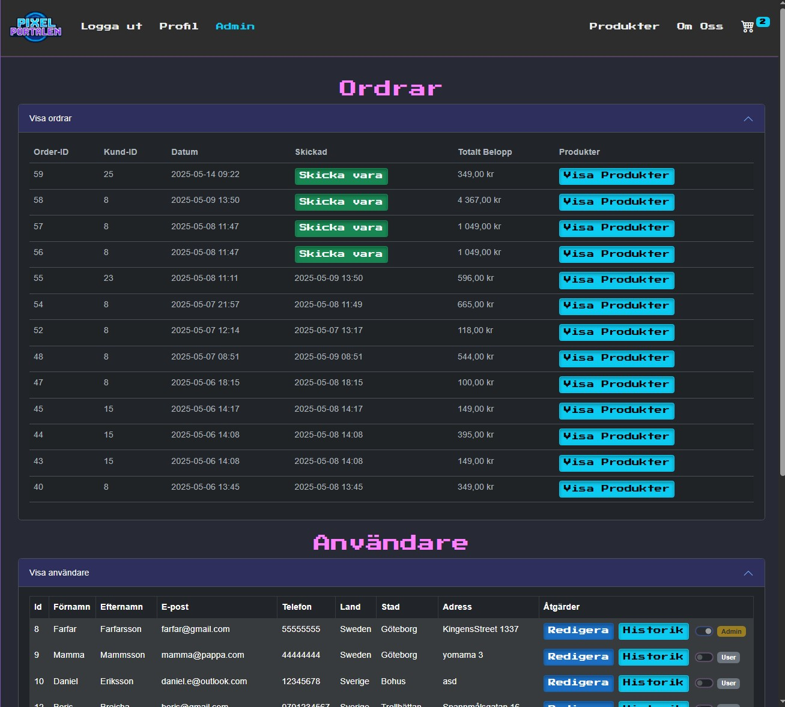

# Setup instructions

1. Restore Database with PixelPortalen.Bak to your SQL database.
2. Change the connection string in PixelPortalen/appsettings.json to match yours. Don't push/publish nonlocal SQL server information
3. Run the API and the Frontend program.cs files with your IDE (there is a "Start Both" setting).
4. There is a test admin account for the site that you can use

```
Email: admin@test.nu
Password: qwerty
```

# PixelPortalen

This project was our largest schoolproject where we got an assignment to work in group with 3 classes during 5 weeks to create a working webbshop from scratch. Our class that was focused on doing the fullstack work, one class specialized in testing (RobotFramework) and the last one focusing on .NET Cloud and the implementation on Azure. The participation on the Cloud group was probably the biggest letdown of the whole project but we worked hard with the testers.

# My effort in the project

I was one of the two that was a big part of leading the project and descided what to do and which direction to go. I also was the one presenting it on the last 2 days of the project.

My bigger programming focus/work on this page have been to set up the base for the API with the product related stuff like controller, repository, service, the generic repository and also the models/entities. Then for the frontend my main focus was more to clean up code and fix styles. But I also implemented the filter and pagination for the product page and cleaned up the sorting function. I also added the category/genre part to the add/edit product page which uses a generic modal but with the time used I'm not totally stoked about the method behind it. And the order part for the admin page and the "send shipping" functionality.

# About

Our API is built with ASP.NET MVC that connects with an SQL server. It uses a repository/service pattern and it has a generic repository for the most common CRUD operations. It also uses JWT tokens for authentication on some of the endpoints like `api/customers` requires you to be an admin.

Frontend is a server-sided Blazor app that's using mostly bootstrap to get the style right, on top of that is also CSS. Like the backend we also uses a JWT token saved in localstorage to autorize/autenticate the users so the admin can see the admin stuff and the customers won't.

We got the name PixelPortalen in the assignment and we knew we wanted a pixelated style on the page and incorporate a portal into the logo. The neon color theme grew and we really liked the look of it.
Here is a screenshot of the landingpage where we show a gif of the logo, five randomized products and upcomming events.


When you hover a product we added a zoom for it to feel more engaging and when you click to buy a product you get a [toast](https://getbootstrap.com/docs/5.3/components/toasts/) popup to confirm that the product was put into the cart.



One of the criterias for the webbshop was to filter the products by genres, sort it by price and name and here is our filter by genres. It lists all the genres. If we had more time I would have liked to add how many of each there is and when one genre is selected it shows how many that have the next and so on.



To make the app less dependent on developers for managing the products we added the possibility for the buyer/admin of the page to add and edit their own products/genres/categories.



Another criteria was that the admin should be able to see placed orders, watch specific users and their history and current cart. I also added a functionality for the admin to mark unsent order as sent.



Overall I'm very happy with the result for such a short period of time.
If we got another 2-3 weeks on it I guess the main focus would have been to work more on mobile responsiveness and make the styling on the profile and admin page better match the rest. Would also be great to make the page not send as many API requests. By saving products on the page and use it instead of calling for them all the time. Same with the cart, make it save locally until you order or leave the site and then call the API. Now it's calling the API / database for each update to the cart which would never work in a real time scenario

---
Thanks for reading</br>
/Kristoffer Linder